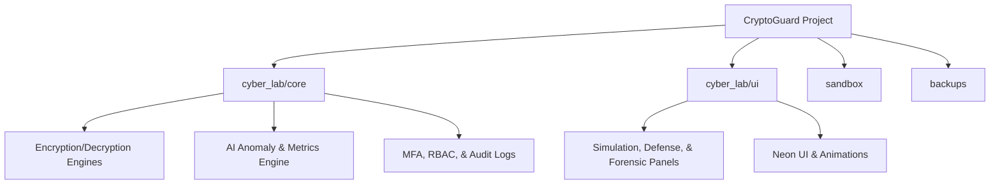
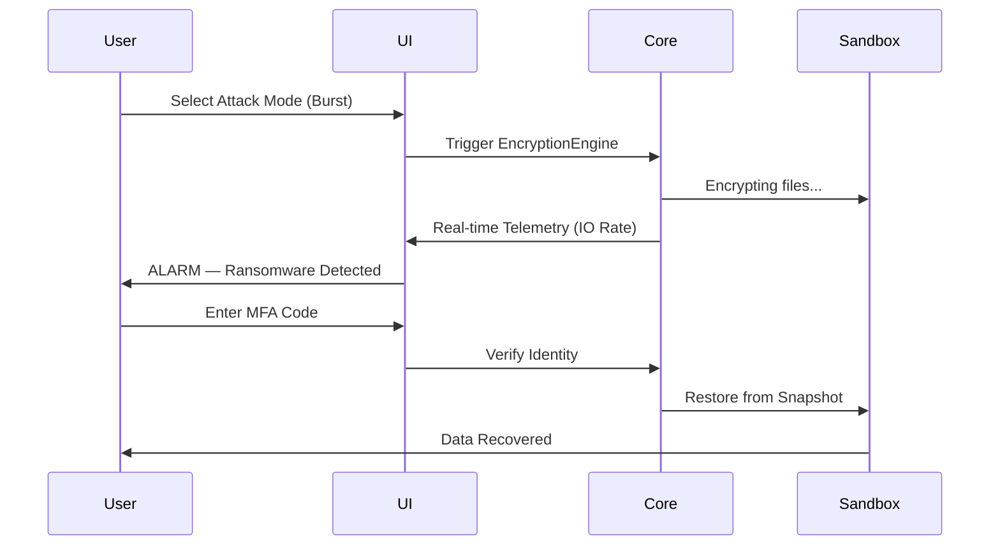

# 🛡️ CryptoGuard: Ransomware Detection and Endpoint Response Prototype

**Status:** 🟢 Working Prototype &nbsp;·&nbsp; Cybersecurity &nbsp;·&nbsp; Summer Training Project &nbsp;·&nbsp; 2026

[](https://github.com/muskan-85/CryptoGuard)
[](#-project-preview)
[](https://www.linkedin.com/in/muskan-9b5b99389)

> **A high-fidelity, educational cybersecurity sandbox for simulating ransomware attacks and deploying multi-layered defense mechanisms in a safe, controlled environment.**

---

## ⚠️ Caution & Disclaimers

> **IMPORTANT — EDUCATIONAL USE ONLY**
> This project is built for **EDUCATIONAL AND RESEARCH PURPOSES ONLY**.
> The author is not responsible for any misuse. Using these techniques against systems without explicit permission is illegal and unethical.

**Cautions:**
- This software simulates ransomware within a dedicated `sandbox/` folder only.
- **DO NOT** run the encryption engine on personal or sensitive data.
- Always confirm the simulation path points to the internal `sandbox/` directory.

**Notes:**
- All simulated attacks are performed on mock files in a local directory.
- No actual malware or malicious payloads are included in this repository.

---

## 🛡️ Introduction

In an era where ransomware causes billions in global damages, understanding the **Kill Chain** and defense strategies is critical. **CryptoGuard** is a comprehensive toolkit that demonstrates how ransomware operates—from delivery to encryption—and how elite defense systems detect, block, and recover from such threats.

**What is Ransomware?**
Ransomware is malicious software designed to block access to a system or encrypt data until a ransom is paid. The *WannaCry* attack of 2017 is a real-world example — it encrypted hundreds of thousands of computers globally, crippling hospitals and businesses.

**What is a Defense Mechanism?**
A defense mechanism is a proactive or reactive security measure to protect digital assets — such as behavior monitoring (watching for high-speed file changes) or automated backups (snapshots), following the "3-2-1" backup rule.

---

## 🚀 Installation & Running

**Requirements:** Python 3.10+ · Virtual Environment (recommended)

### Step 1 — Clone the Repository
```bash
git clone https://github.com/muskan-85/CryptoGuard
cd CryptoGuard
```

### Step 2 — Setup Virtual Environment
```powershell
python -m venv .venv
.venv\Scripts\Activate.ps1
```

### Step 3 — Install Dependencies
```bash
pip install -r requirements.txt
```

### Step 4 — Run the Application
```bash
python cyber_lab/app.py
```

---

## 📊 Folder Structure



| Folder | Role |
|---|---|
| `cyber_lab/core/` | The **Brain** — encryption logic, AI engines, security protocols |
| `cyber_lab/ui/` | The **Face** — PySide6 GUI panels and animations |
| `sandbox/` | The **Target** — mock files that get encrypted and restored |
| `backups/` | The **Vault** — immutable snapshots of original data |

---

## 📌 Project Information

| Category | Details |
|---|---|
| Project Name | CryptoGuard |
| Project Type | Cybersecurity Desktop Application |
| Domain | Ransomware Detection & Endpoint Response |
| Language | Python 3 |
| GUI Framework | PySide6 (Qt) |
| Status | Working Prototype |
| Context | Summer Training Project — 45 Days (Post 4th Semester) |
| Developed By | Muskan |
| Year | 2026 |

---

## 🛠️ Technologies & Techniques

| Category | Technology | Purpose |
|---|---|---|
| Language | Python 3 | Core application logic |
| GUI | PySide6 (Qt) | Neon/Glassmorphism interface |
| Encryption | Fernet (Cryptography) | Symmetric encryption simulation |
| AI | Scikit-learn (Simulated) | Anomaly detection & baseline profiling |
| Security | TOTP via PyOTP | Multi-Factor Authentication (MFA) |
| Monitoring | Watchdog | Real-time file system event detection |
| Analytics | Matplotlib | Live telemetry and encryption rate graphs |
| Web Portal | Flask | Launch portal for the desktop GUI |

**Simulated Attack Modes:**
1. **Burst Attack** — Multi-threaded, high-speed encryption (simulates LockBit style)
2. **Stealth Attack** — Slow, delayed encryption to evade heuristic monitors
3. **Random Spray** — Non-linear file order to bypass simple rate limiters

---

## ✨ Features & Functions

### 1. 🖥️ Dashboard & Navigation Console
- Real-time particle network background animation
- Live telemetry charts (CPU, RAM, encryption rate)
- Threat level, AI anomaly risk, and system health cards

### 2. ⚔️ Simulation Engine
- Launch Ransomware Attack (Burst / Stealth / Standard modes)
- Progress tracking with real-time callbacks
- Audit log entry on every attack event

### 3. 🛡️ Defense Operations Center
- **Behavior Monitoring** — `watchdog` file system observer detects changes in real time
- **Honeypot Traps** — Decoy files (passwords.txt, id_rsa, wallet.dat) trigger alarms on access
- **AI Anomaly Engine** — Weighted risk score using write frequency, entropy, and extension changes
- **Baseline Profiler** — Learns normal system behavior; flags deviations
- **Auto-Restore** — Automatically triggers backup restore on alarm

### 4. 🔑 Key Vault & Identity
- **Key Manager** — Fernet key generation, rotation, and archival with timestamps
- **MFA (TOTP)** — 6-digit time-based OTP required before decryption
- **RBAC** — Role-Based Access Control: Admin, Operator, Auditor roles

### 5. 🔬 Forensic Lab
- **Memory Dumps** — Simulated RAM artifact capture with suspicious strings
- **Pen-Test Scanner** — Finds paths like "Insecure Backups" or "Weak Auth"
- **Simulated Exploit** — 70% success-rate exploit simulation per vulnerability

### 6. ⚔️ Cyber Range (Red vs Blue)
- 60-second live rounds with real-time scoring
- Network traffic simulator (C2 beacons, data exfiltration events)
- Phishing awareness test with social engineering popups

### 7. 📊 Reporting & Analytics
- HTML incident reports with full attack timeline
- JSON forensic audit export
- Hash-chained tamper-proof audit trail

---

## 📈 System Flow



---

## 📸 Project Preview

<table>
<tr>
<td width="50%"></td>
<td width="50%"></td>
</tr>
<tr>
<td width="50%"></td>
<td width="50%"></td>
</tr>
<tr>
<td width="50%"></td>
<td width="50%"></td>
</tr>
<tr>
<td width="50%"></td>
<td width="50%"></td>
</tr>
<tr>
<td width="50%"></td>
<td width="50%"></td>
</tr>
<tr>
<td width="50%"></td>
<td width="50%"></td>
</tr>
</table>

---

## 🎓 What I Learned & Market Value

**Context:** Built as a 45-day Summer Training Project after 4th semester, focusing on applied cybersecurity concepts.

**Learning Outcomes:**
- Mastered **Symmetric Encryption** and Key Lifecycle Management (generation, rotation, archival)
- Implemented **Behavioral Analysis** using real file-system hooks via `watchdog`
- Designed a **High-Performance GUI** with multithreading (QThread) to prevent UI freezes
- Built a **Hash-Chained Audit Logger** for tamper-evident logging
- Integrated enterprise security features: RBAC, TOTP-based MFA, AI anomaly scoring

**Market Value:**
In the trending cybersecurity market, "Breach and Attack Simulation" (BAS) is a billion-dollar sector. Skills in self-healing systems, forensic visibility, and behavioral detection are highly sought after by top-tier security firms.

---

## 🔮 Future Enhancements

- **Network Propagation** — Simulate ransomware spreading across a mock LAN
- **Web Interface** — React/Vite dashboard with FastAPI backend
- **Hardware MFA** — Physical security key support (YubiKey simulation)
- **SIEM Integration** — Feed events into a mock Splunk/ELK dashboard
- **ML Model** — Replace simulated AI with a real trained Isolation Forest model

---

## 🏷️ Tags

`#CyberSecurity` `#Ransomware` `#Python` `#PySide6` `#BlueTeam` `#RedTeam` `#Pentesting` `#Forensics` `#AI` `#AnomalyDetection` `#EduTech` `#Encryption` `#SummerTraining`

---

## ⭐ Support & Engagement

If you find this project useful, please consider:
- ⭐ **Starring** the repository
- 🔁 **Sharing** it within your network
- 👤 **Following** for future projects

— **Muskan**

[](https://github.com/muskan-85)
[](https://www.linkedin.com/in/muskan-9b5b99389)

---

*Created with ❤️ for the future defenders of the digital realm.*
**Muskan ©2026**